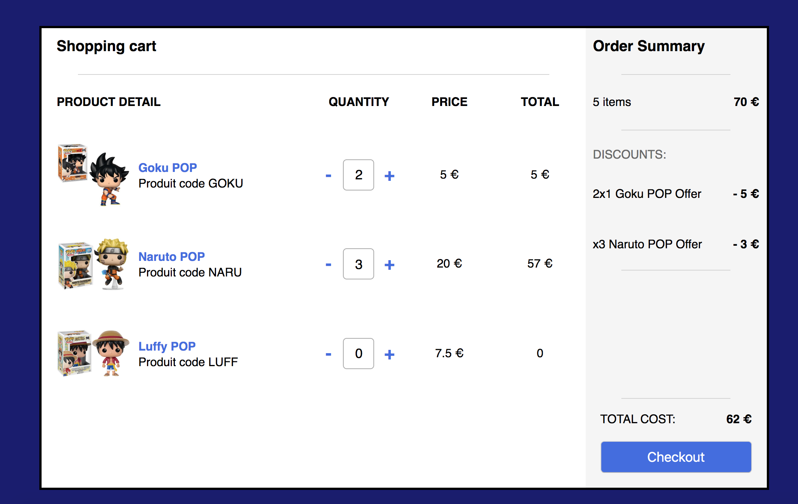
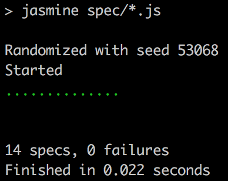
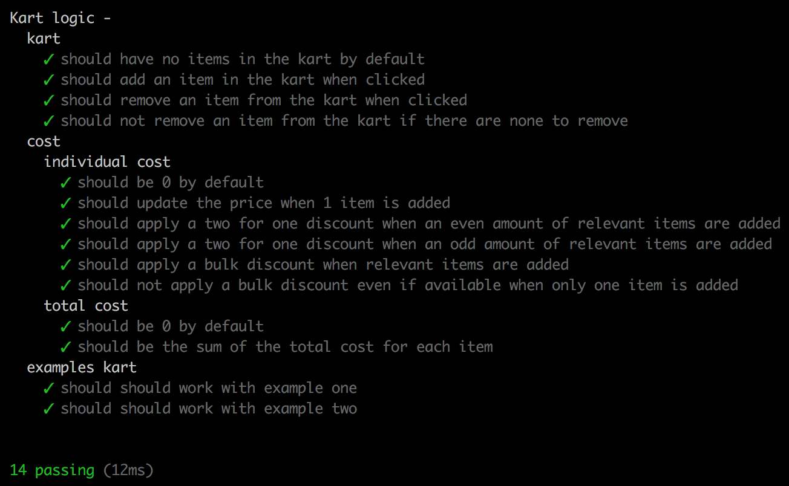

[](https://travis-ci.com/GBouffard/pop-in-a-box-eCommerce)

# :dolls: Pop in a box eCommerce shop :dolls:

This is a little e-commerce web application. The current prices of the
available products are the following:

| Code |    Name    | Price  |
| ---- | :--------: | ------ |
| GOKU |  Goku POP  | 5.00€  |
| NARU | Naruto POP | 20.00€ |
| LUF  | Luffy POP  | 7.50€  |

There are products discounts that will be applied automatically under some conditions:

- **2-for-1 promotions**: buy two of the same product, get one free.  
  This is applied to **GOKU** items.

- **bulk discounts**: buying x or more of a product, the price of that product is
  reduced.  
  This is applied to **NARU** items.  
  For example if you buy 3 or more NARU items, the price per unit should be 19.00€.

## Technologies used

- Javascript
- JQuery
- Jasmine
- Chai
- HTML
- Sass
- Node
- Express
- Open

## How to run it

```
git clone git@github.com:GBouffard/pop-in-a-box-eCommerce.git
cd pop-in-a-box-eCommerce
./build.sh
```

The sheel script automatically:

- install packages
- run the unit tests
- start the server
- open the app
  nb: the page automatically opens with `google chrome`; if you would rather have firefox for example, just change `google chrome` on line 16 of `server.js` to `firefox`.

## Screenshot



## Additional tests

Jasmine's tests are passing but Jasmine's SpecRunner seems to not work like it used to.
The only visual available is the dotted one:



In order to get a better visual representation I also wrote the tests using a combination of Chai and Mocha.
It runs with:

```
npm run chai-test
```

and here is the test report:


